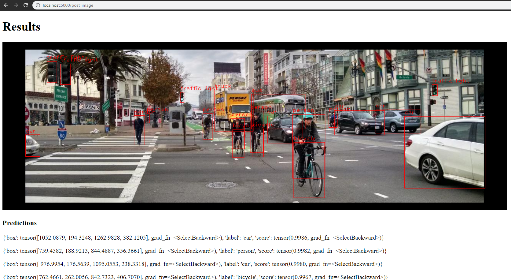

# faster-rcnn-flask
Small flask application demonstrating the Faster R-CNN object detection model. It takes in user input images and passes it to PyTorch's
pre-trained Faster R-CNN model where it outputs predictions of objects within the input image. The predictions include bounding box
coordinates, label of the object, and the confidence score probability for that object. Using the information from the predictions, I just mapped the bounding boxes and labels using Open-CV and returned that image back to the user for inspection.

## Using this repository

```
$ git clone https://github.com/rae0924/faster-rcnn-flask.git
$ cd faster-rcnn-flask
$ python3 -m venv venv
$ source venv/bin/activate // venv/Scripts/activate for windows
$ pip3 install -r requirements.txt
$ python3 flask/run.py
```
The web server is hosted at http//:localhost:5000 and is accessible through your browser.

## User Interface

Just upload image of choice once on the web application. Hit submit. The output of the model is shown as such: 



Note: Some predictions are cut off on the image above.

## Customize score threshold

I've included a way to reduce the amount of objects that are outputted into the screen by introducing a filter
through score. By default, any objects under the score of 0.70 will be ignored in the mapping of bounding boxes 
and labels. You can change that parameter under flask/app/detection.py in the process_predictions() function. To
include more objects.
